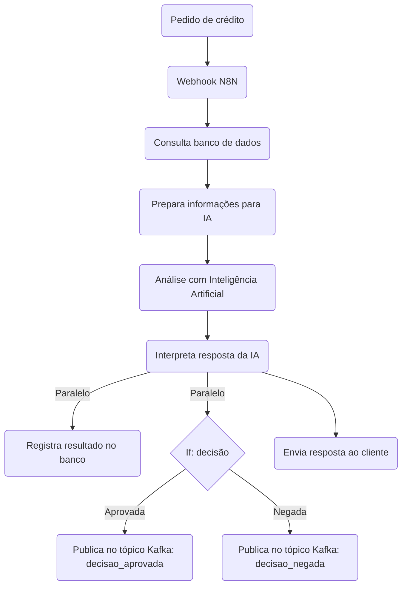

# POC de Análise de Crédito com Inteligência Artificial

## O que é esta POC?

Esta Prova de Conceito (POC) demonstra como uma instituição financeira pode automatizar a análise de pedidos de crédito (empréstimos) usando tecnologia moderna e Inteligência Artificial (IA). O objetivo é mostrar como é possível tomar decisões mais rápidas, justas e explicáveis, sem depender apenas de regras fixas ou análise manual.

---

## Por que automatizar a análise de crédito?

Tradicionalmente, bancos e financeiras usam regras rígidas ou análise manual para decidir se um cliente pode ou não receber um empréstimo. Isso pode ser demorado, caro e, às vezes, injusto. Com IA, é possível analisar diversos fatores ao mesmo tempo e tomar decisões mais personalizadas, além de explicar claramente o motivo de cada decisão.

---

## Como funciona este projeto?

### 1. Recebendo o pedido do cliente

- O cliente faz um pedido de crédito (empréstimo), informando:
  - CPF (identificação)
  - Valor desejado do empréstimo
  - Quantidade de parcelas que gostaria de pagar
  - Finalidade do empréstimo (ex: reforma, viagem, etc.)

### 2. Buscando informações no banco de dados

- O sistema consulta um banco de dados para buscar:
  - Dados cadastrais e financeiros do cliente (renda, score de crédito, limite pré-aprovado, etc.)
  - Quais empréstimos o cliente já possui e quanto paga por eles

### 3. Preparando a análise

- O sistema calcula quanto da renda do cliente já está comprometida com outros empréstimos.
- Simula diferentes opções de parcelamento para o novo empréstimo.
- Junta todas essas informações em um texto explicativo (chamado de “prompt”).

### 4. Análise com Inteligência Artificial

- O texto explicativo é enviado para um serviço de IA (OpenAI), que “pensa” como um analista humano.
- A IA avalia se o empréstimo deve ser aprovado ou não, qual o número ideal de parcelas e o valor recomendado para cada parcela.
- A IA também explica o motivo da decisão, de forma clara.

### 5. Registrando e respondendo

- O resultado da análise é salvo no banco de dados para histórico.
- O sistema responde ao cliente, informando:
  - Se o crédito foi aprovado ou negado
  - O motivo da decisão
  - Quantas parcelas são recomendadas e qual o valor ideal de cada parcela

---

## Quais tecnologias são usadas?

- **Supabase**: Um banco de dados online onde ficam armazenadas todas as informações dos clientes e empréstimos.
- **N8N**: Uma ferramenta que conecta diferentes sistemas e automatiza o fluxo de trabalho.
- **OpenAI**: Serviço de Inteligência Artificial que faz a análise do crédito.
- **Docker**: Um programa que facilita instalar e rodar todos esses sistemas juntos, sem complicação.

---

## Mensageria e Eventos com Kafka

O projeto agora conta com uma arquitetura orientada a eventos utilizando o **Apache Kafka** para mensageria. Isso permite que decisões de crédito sejam publicadas em tópicos distintos, facilitando integrações, rastreabilidade e escalabilidade do fluxo.

### O que foi adicionado:
- **Serviços Kafka e Zookeeper** no `docker-compose.yml`, já configurados para uso local.
- **Criação automática de tópicos** ao subir o ambiente, via script `init-kafka-topics.sh` e container auxiliar `kafka-init`.
- **Tópicos separados** para cada tipo de decisão (ex: `decisao_aprovada`, `decisao_negada`).
- **Documentação de como inspecionar mensagens** produzidas nos tópicos.

### Como funciona o novo fluxo no N8N
Após o nó "formata dados":
- O fluxo segue em paralelo para:
  - **Salvar a decisão no banco de dados** (PostgreSQL)
  - **Publicar um evento Kafka** em um tópico específico conforme o resultado da decisão

Para direcionar a mensagem ao tópico correto, foi utilizado o nó **If** do N8N:
- O nó "If" avalia o campo de decisão (ex: `{{$json.decisao}}`).
- Se for "aprovada", publica no tópico `decisao_aprovada`.
- Se for "negada", publica no tópico `decisao_negada`.
- O payload enviado para o Kafka é o mesmo gerado pelo nó "formata dados".

#### Exemplo visual do fluxo:

```
[formata dados]
   /           \
[Insert DB]   [If: decisao]
                |      \
       [Kafka:aprovada] [Kafka:negada]
```

### Como configurar e rodar
1. Suba o ambiente normalmente:
   ```sh
   docker-compose up --build
   ```
2. O script de inicialização criará automaticamente os tópicos necessários.
3. Configure o nó Kafka Producer no N8N:
   - **Broker:**
     - Se o N8N está em container: `kafka:9092`
     - Se o N8N está fora do Docker Compose: `localhost:29092`
   - **Topic:**
     - `decisao_aprovada` ou `decisao_negada`, conforme o resultado avaliado no nó "If"
   - **Message:**
     - Use o conteúdo do JSON do nó "formata dados"

---

## Como visualizar mensagens dos tópicos Kafka

Você pode inspecionar as mensagens produzidas nos tópicos Kafka usando o utilitário de linha de comando `kafka-console-consumer` diretamente no container Kafka. Isso é útil para depuração, auditoria e validação dos fluxos de eventos.

### Passo a Passo

1. **Acesse o terminal do seu sistema operacional.**
2. **Execute o comando abaixo para acessar o container Kafka:**

```sh
docker exec -it kafka kafka-console-consumer --bootstrap-server kafka:9092 --topic <nome_do_topico> --from-beginning
```

- Substitua `<nome_do_topico>` pelo nome do tópico que deseja inspecionar, por exemplo:
  - `decisao_aprovada`
  - `decisao_negada`

**Exemplo:**

```sh
docker exec -it kafka kafka-console-consumer --bootstrap-server kafka:9092 --topic decisao_aprovada --from-beginning
```

3. **As mensagens do tópico serão exibidas no terminal.**
   - Para encerrar a visualização, pressione `Ctrl+C`.

---

## Passo a passo visual do processo



---

## Exemplos práticos

### Exemplo de pedido de crédito

```json
{
  "cpf": "456.789.123-00",
  "valorSolicitado": 5000,
  "parcelaSolicitada": 24,
  "finalidade": "Carro"
}
```

### Exemplo de resposta ao cliente

```json
{
	"cliente_id": "4782f09d-0703-4b6e-a06d-0dd66cd8cfc8",
	"valor_solicitado": 3000,
	"finalidade": "Carro",
	"resultado": "negado",
	"motivo": "A aprovação do pedido de empréstimo não é viável devido ao histórico de pagamento ruim da cliente, que sugere uma falta de responsabilidade financeira e potencial para inadimplência. Apesar do score de crédito de 610 ser considerado médio, a preocupação com o histórico negativo é um fator determinante. Além disso, o comprometimento estimado da renda, que subiria para 22.83%, está perto do limite geralmente recomendado (30%) para garantir a saúde financeira da cliente, o que indica que o novo empréstimo pode dificultar ainda mais a capacidade de pagamento.",
	"analise_ia": "DECISÃO: NEGADO\n\nMOTIVO: A aprovação do pedido de empréstimo não é viável devido ao histórico de pagamento ruim da cliente, que sugere uma falta de responsabilidade financeira e potencial para inadimplência. Apesar do score de crédito de 610 ser considerado médio, a preocupação com o histórico negativo é um fator determinante. Além disso, o comprometimento estimado da renda, que subiria para 22.83%, está perto do limite geralmente recomendado (30%) para garantir a saúde financeira da cliente, o que indica que o novo empréstimo pode dificultar ainda mais a capacidade de pagamento.\n\nPARCELAS RECOMENDADAS: N/A\n\nVALOR DA PARCELA: N/A\n\nANÁLISE DE RISCO:\n1. A cliente já possui um comprometimento de renda elevado (20.80%) com o empréstimo atual, o que limita sua margem para um novo crédito.\n2. O histórico de pagamento ruim, aliado a uma renda relativamente baixa, pode aumentar o risco de inadimplência no futuro, caso a situação financeira da cliente se complique.\n3. O score de crédito médio, embora não seja um fator definitivo, não compensa as preocupações relacionadas ao histórico financeiro da cliente, aumentando a incerteza em relação ao pagamento das parcelas.\n\nRECOMENDAÇÕES: É aconselhável que Ana busque melhorar sua situação financeira antes de solicitar outro empréstimo. Aumentar a taxa de quitação de suas dívidas atuais, e construir um histórico de pagamentos positivos podem ajudar a elevar seu score de crédito e proporcionar uma melhor avaliação em futuros pedidos de crédito. Além disso, ela deve considerar uma gestão mais rigorosa de suas despesas mensais para diminuir o comprometimento de sua renda.",
	"parcelas_solicitadas": 60,
	"parcelas_recomendadas": 0,
	"valor_parcela_recomendado": 50.74999999999999
}
```

---

## Estrutura do banco de dados (resumido)

| Tabela                  | O que armazena?                                                    |
|-------------------------|---------------------------------------------------------------------|
| clientes                | Dados pessoais e financeiros de cada cliente                        |
| emprestimos             | Empréstimos já contratados pelo cliente                            |
| solicitacoes_credito    | Histórico de todos os pedidos de crédito analisados e decididos                |

---

## Como rodar o projeto (passo a passo simples)

1. **Instale o Docker** (não precisa instalar cada sistema separadamente).
2. **Baixe os arquivos do projeto**.
3. **Configure as senhas e chaves** (instruções no README).
4. **Execute o comando para subir os containers:**
   ```sh
   docker-compose up -d
   ```
5. **Acesse o painel do N8N** pelo navegador para acompanhar o fluxo.
6. **Faça um teste**: envie um pedido de crédito e veja a resposta automática!

---

## Comandos úteis do Docker

- **Subir os containers do projeto:**
  ```sh
  docker-compose up -d
  ```

- **Parar todos os containers do projeto:**
  ```sh
  docker-compose down
  ```

- **Parar e remover containers, redes e volumes (apaga os dados do banco!):**
  ```sh
  docker-compose down -v
  ```

- **Verificar containers ativos:**
  ```sh
  docker ps -a
  ```

- **Remover um container específico:**
  ```sh
  docker rm nome_do_container
  ```

> **Atenção:** O comando `docker-compose down -v` apaga todos os dados persistidos do banco de dados. Use com cuidado se quiser manter o histórico!

---

## Por que este projeto é inovador?

- **Decisão rápida e personalizada**: a IA analisa cada caso individualmente.
- **Transparência**: o cliente sempre sabe o motivo da decisão.
- **Facilidade de uso**: todo o processo é automatizado, sem necessidade de conhecimento técnico.
- **Flexibilidade**: pode ser adaptado para qualquer instituição financeira.

---

## Glossário

- **POC**: Prova de Conceito, um experimento para testar uma ideia.
- **IA**: Inteligência Artificial, tecnologia que simula o raciocínio humano.
- **Webhook**: Um ponto de entrada para receber informações de outros sistemas automaticamente.
- **Docker**: Ferramenta para rodar vários sistemas juntos, sem conflito.
- **N8N**: Plataforma para automatizar tarefas e conectar diferentes sistemas.

---

## Configuração do arquivo `.env`

> **Importante:**
> Ao clonar este repositório, você deve criar um arquivo chamado `.env` na raiz do projeto para que o ambiente funcione corretamente. Este arquivo **NÃO** é versionado por questões de segurança.

### Exemplo de configuração do arquivo `.env`

```env
POSTGRES_USER=postgres
POSTGRES_PASSWORD=postgres
POSTGRES_DB=postgres
POSTGRES_HOST=db
N8N_BASIC_AUTH_ACTIVE=true
N8N_BASIC_AUTH_USER=admin@example.com
N8N_BASIC_AUTH_PASSWORD=n8n
```

- Altere os valores conforme necessário para seu ambiente.
- Estes valores são usados automaticamente pelo Docker Compose e pelos serviços do projeto.

Se tiver dúvidas sobre a configuração, consulte a documentação ou o arquivo `docker-compose.yml` para ver como as variáveis são utilizadas.

---

## Estrutura dos Arquivos do Projeto

Abaixo está uma explicação dos principais arquivos e diretórios deste projeto e seus respectivos objetivos:

| Arquivo/Diretório                | Objetivo                                                                 |
|----------------------------------|--------------------------------------------------------------------------|
| `README.md`                      | Documentação principal do projeto, instruções de uso e informações gerais|
| `.gitignore`                     | Lista de arquivos e pastas ignorados pelo Git (ex: `.env`, dados locais) |
| `.env`                           | Variáveis de ambiente sensíveis (NÃO versionado, exemplo no README)      |
| `docker-compose.yml`             | Orquestração dos containers Docker (banco, N8N, etc)                     |
| `init-db.sql`                    | Script SQL para criar e popular o banco de dados com massa de teste      |
| `docs/estrutura-db.md`           | Documentação detalhada do modelo de dados e exemplos de inserts, ao subir o projeto          |
| `docs/guia-refatoracao.md`       | Guia técnico e didático sobre toda a refatoração e decisões do projeto   |
| `n8n_data/`                      | Volume Docker para persistir dados e workflows do N8N                    |
| `supabase_db_data/`              | Volume Docker para persistir dados do banco Postgres/Supabase            |
| `docs/`                          | Pasta para documentação adicional, guias e apresentações                 |

- Outros arquivos e diretórios podem ser adicionados conforme o projeto evolui.
- Sempre consulte esta seção ou o próprio arquivo para entender o propósito de cada item.
