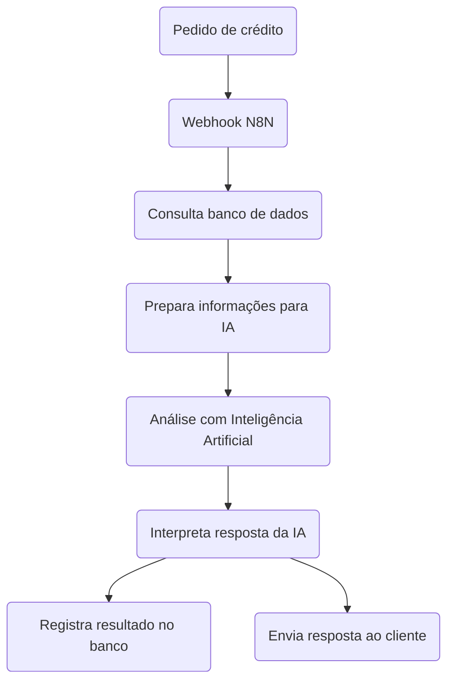

# Apresentação: POC de Análise de Crédito com IA

---

## 1. O que é Análise de Crédito?

Análise de crédito é o processo pelo qual uma instituição financeira decide se um cliente pode ou não receber um empréstimo. Normalmente, isso envolve analisar dados como renda, histórico de pagamento, dívidas existentes e outros fatores.

---

## 2. O que é uma POC?

POC significa Prova de Conceito. É um experimento para mostrar que uma ideia pode funcionar na prática, antes de investir em um sistema completo.

---

## 3. Objetivo deste Projeto

Demonstrar como automatizar a análise de crédito usando Inteligência Artificial, tornando o processo mais rápido, transparente e adaptável.

---

## 4. Componentes do Projeto

- **Supabase:** Banco de dados online para armazenar informações de clientes e empréstimos.
- **N8N:** Plataforma de automação que conecta sistemas e organiza o fluxo de trabalho.
- **OpenAI:** Serviço de Inteligência Artificial que faz a análise do crédito.
- **Docker:** Ferramenta que facilita a instalação e execução de todos os sistemas juntos.

---

## 5. Como Funciona o Fluxo

1. **Cliente faz o pedido:**
   - Informa CPF, valor desejado, número de parcelas e finalidade do empréstimo.
2. **Sistema busca informações:**
   - Consulta o banco de dados para pegar dados do cliente e seus empréstimos.
3. **Preparação para IA:**
   - O sistema calcula quanto da renda já está comprometida e simula opções de parcelamento.
4. **Análise com IA:**
   - A IA avalia o pedido, sugere o número ideal de parcelas, valor da parcela e explica o motivo da decisão.
5. **Resposta e registro:**
   - O resultado é salvo e enviado ao cliente.

---

## 6. Visual do Processo



---

## 7. Exemplo de Pedido e Resposta

**Pedido:**
```json
{
  "cpf": "12345678900",
  "valor": 5000,
  "parcelas": 24,
  "finalidade": "Reforma"
}
```

**Resposta:**
```json
{
  "sucesso": true,
  "resultado": "aprovado",
  "motivo": "Cliente com bom histórico e renda suficiente.",
  "parcelas_recomendadas": 24,
  "valor_parcela_recomendado": 220.00,
  "comprometimento_atual": "25%",
  "novo_comprometimento": "35%",
  "analise_completa": "DECISÃO: APROVADO ... (texto completo da IA)"
}
```

---

## 8. Estrutura do Banco de Dados (Resumo)

| Tabela                  | O que armazena?                                                    |
|-------------------------|---------------------------------------------------------------------|
| clientes                | Dados pessoais e financeiros de cada cliente                        |
| emprestimos             | Empréstimos já contratados pelo cliente                            |
| solicitacoes_credito    | Histórico de todos os pedidos de crédito realizados                |
| parametros_credito      | (Opcional) Regras gerais de aprovação, se desejar usar junto com IA |

---

## 9. Benefícios do Projeto

- Decisão rápida e personalizada
- Cliente entende o motivo da decisão
- Processo totalmente automatizado
- Fácil de adaptar para outros cenários

---

## 10. Glossário

- **POC:** Prova de Conceito
- **IA:** Inteligência Artificial
- **Webhook:** Ponto de entrada para receber informações automaticamente
- **Docker:** Ferramenta para rodar vários sistemas juntos
- **N8N:** Plataforma de automação

---

Dúvidas? Pergunte!
